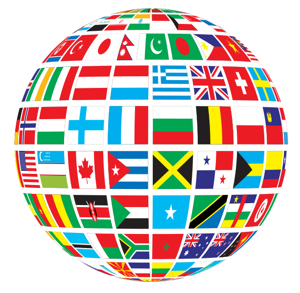

# Dot Net Flags

<!--BadgesSTART-->
<!-- Powered by https://github.com/GregTrevellick/ReadMeSynchronizer -->

<!-- no md -->

<!-- no md -->
<!-- no md -->

<!--BadgesEND-->

When you add this package to your dot net standard project it will add a collection of country flag images toyour .Net standard project. Various sizes and formats, including SVG.

No functionality, just a convenient collection of flags in one place.

Also contains flags for U.S. states.

**Important** : If you wish to use flags for free in the Icon Drawer folder on a website you must place link to [www.icondrawer.com](www.icondrawer.com) in a static first level page of your site (not in blog or news page). Alternatively you can purchase a [royalty-free license](http://www.icondrawer.com/buy.php#license).

[Contributions](https://github.com/GregTrevellick/DotNetFlags/pulls) welcome.

[Installation instructions](https://www.nuget.org/packages/DotNetFlags/)

## Credits

[365 Icon](http://365icon.com/icon-styles/ethnic/classic2/)

[Enrico Maria Crisostomo](https://github.com/emcrisostomo/flags)

[Flagpedia](http://flagpedia.net/download)

[Hampus Joakim Nilsson](https://github.com/hjnilsson/country-flags)

[Icon Drawer](http://www.icondrawer.com/free.php)

[Wikimedia Commons](https://commons.wikimedia.org/wiki/File:GDJ-World-Flags-Globe.svg)
